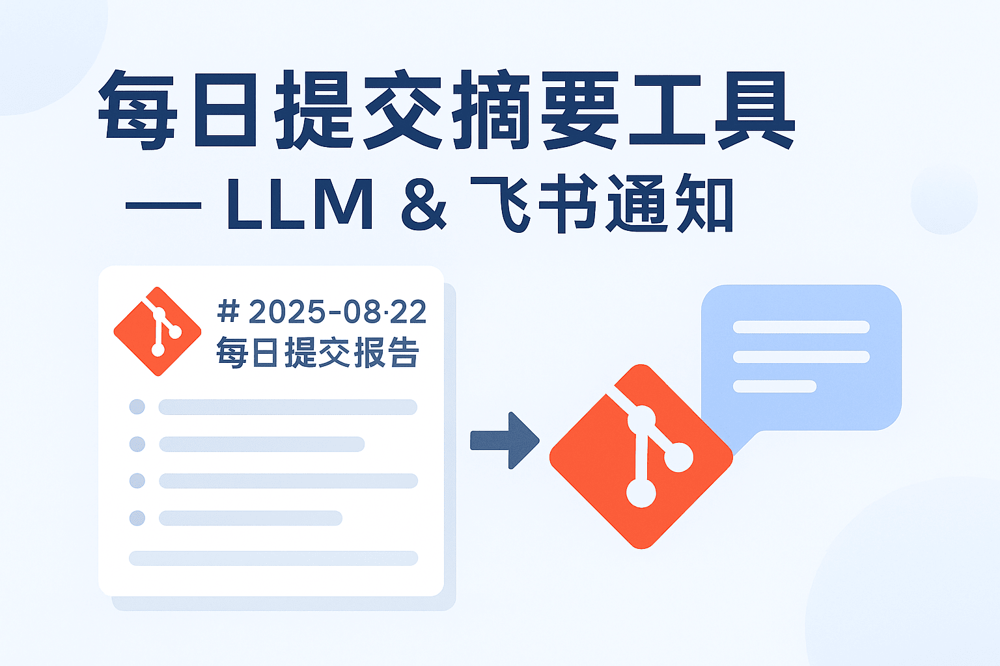

# Daily Commit Summarizer



## 📌 Scenario

Software teams often want a quick overview of what happened in their repositories each day without reading through raw git log or giant pull requests.

This project provides a GitHub Actions workflow and a TypeScript script that:
1. Runs every day at 6:00 PM Beijing time (UTC+8).
2. Collects all commits from all remote branches made during the day.
3. Uses an LLM (e.g., OpenAI GPT-4.1-mini) to:
  - Split large diffs into manageable chunks.
  - Summarize each commit individually (changes, impact, risks, test suggestions).
  - Merge everything into a daily summary report.
4. Sends the summary to a Feishu (Lark) group chat via Webhook.

This gives your team a concise, human-readable daily changelog that improves visibility and saves review time.

<br/>

## 🚀 Features

1. Cross-branch coverage: analyzes commits from all origin/* branches.
2. Chunked diffs: handles large commits safely within LLM context limits.
3. Multi-level summarization:per-diff-chunk → per-commit → daily overview.
4. Feishu notifications: daily digest delivered to your chat group.
5. Configurable: choose model, branch filters, chunk sizes, etc.

<br/>

## ⚙️ Setup

**1. Fork or clone this repo**

```bash
git clone https://github.com/nanbingxyz/daily-commit-summarizer.git
cd daily-commit-summarizer
```

**2. Add GitHub Actions workflow**

In .github/workflows/daily-summary.yml:

```yaml
name: Daily LLM Commit Summary

on:
  schedule:
    - cron: "0 10 * * *"   # 10:00 UTC = 18:00 Beijing
  workflow_dispatch: {}     # allow manual runs

jobs:
  run:
    runs-on: ubuntu-latest
    env:
      TZ: Asia/Shanghai
    steps:
      - name: Checkout
        uses: actions/checkout@v4
        with:
          fetch-depth: 0

      - name: Setup Node.js
        uses: actions/setup-node@v4
        with:
          node-version: "20"

      - name: Install dependencies
        run: |
          npm install

      - name: Run summarizer
        env:
          OPENAI_BASE_URL: ${{ secrets.OPENAI_BASE_URL }}
          OPENAI_API_KEY: ${{ secrets.OPENAI_API_KEY }}
          LARK_WEBHOOK_URL: ${{ secrets.LARK_WEBHOOK_URL }}
          REPO: ${{ secrets.REPO }}
        run: |
          npx tsx scripts/daily-summary.ts
```
**3. Add repository secrets**

Go to Repo → Settings → Secrets and variables → Actions → New repository secret:
* OPENAI_API_KEY → Your OpenAI (or compatible LLM provider) API key.
* OPENAI_BASE_URL → Your OpenAI (or compatible LLM provider) base URL.
* LARK_WEBHOOK_URL → Feishu group Custom Bot Webhook URL.
* REPO → Your GitHub repository name.

**4. Install dependencies**

`npm install`

<br/>

## 📄 Script Overview

scripts/daily-summary.ts does the heavy lifting:
1. Fetches all remote branches (git fetch --all).
2. Collects today’s commits (git log --since "midnight" --until "now" --all).
3. Builds diffs, splits them into chunks.
4. Calls the LLM API for structured commit summaries.
5. Merges everything into a daily report.
6. Posts the result to Feishu via Webhook.

<br/>

## 🖥 Example Output (Feishu)

```markdown
# 2025-08-22 Daily Commit Report (your-repo)

1. Overview
- Bug fixes in login flow
- New API endpoint for invoices
- Config refactor in dev pipeline

2. Key Changes by Branch
- origin/feature/auth: Added JWT validation middleware
- origin/hotfix/payment: Fixed rounding error in currency converter

3. Risks & Rollback
- Auth middleware may break legacy clients → verify with staging
- Payment hotfix touches shared utility → regression test required

4. Testing Suggestions
- Add unit tests for JWT expiry
- Integration test for invoice creation API

5. Notes
- Lockfile updates ignored
```

<br/>

## 🔧 Configuration

You can tweak behavior with variables:

|Variable|Default|Description|
| ---- | ---- | ---- |
|MODEL_NAME|gpt-4.1-mini|LLM model to call｜
|PER_BRANCH_LIMIT|200|Max commits per branch per day｜
|DIFF_CHUNK_MAX_CHARS|80000|Max diff characters per LLM request|
|TZ|Asia/Shanghai|Timezone for “today”|

<br/>

## 📌 Notes
* Feishu text messages do not support Markdown.
*	For rich formatting (titles, links, lists), consider switching to msg_type: post in postToLark().
* For private repos: don’t leak code to third-party LLMs unless compliant. You can swap OpenAI with your internal LLM gateway.

<br/>

## 🤝 Contributing

Contributions welcome! Ideas:
* Add Slack/Discord/MS Teams adapters.
* Support PR comments in addition to daily digest.
* Extend output with diff statistics (files changed, LOC).

<br/>

## 📜 License

MIT License. Use at your own risk.
